<p align="center">
  
</p>

<h1 align="center">chock-devin-plugins</h1>

<p align="center"><strong>Chock policies as Devin plugins — a real hook that can deny a command, best-effort and fail-open by the vendor's own design.</strong></p>

<p align="center">

[](https://github.com/open-coder-ai/chock-devin-plugins/actions/workflows/generated-only.yml)
[](LICENSE)
[](https://github.com/open-coder-ai/chock-catalog)

</p>

<p align="center">
  
</p>

An agent you're running can already touch your shell, your git history, and your CI config.
You want it to move fast without being the reason a stray `helm uninstall` actually happens.
Telling it to be careful in a prompt is not a guarantee; a plugin that can refuse the command
is closer to one. Devin's own documentation is explicit that plugin hooks are **"currently
best effort and fail open — if a hook fails to load or run, the session continues without it
— so don't rely on them for crucial guardrails yet."** No `devin plugins install` run against
these packages has been recorded yet; the claims on this page come from Devin's published
documentation (docs.devin.ai, read 2026-09-21), not from a witnessed install.

**Local sessions only.** Plugin hooks are registered in Devin CLI and Devin Desktop sessions.
They are not registered in Devin's cloud sessions — a guard installed from here has no effect
there. A hook's exit code decides the outcome: `2` blocks the tool call, `0` lets it continue,
and any other exit is logged but does not block.

## Install

```
devin plugins install open-coder-ai/chock-devin-plugins
```

That installs the root meta-plugin, which offers every policy below as an optional plugin.
To install a single policy instead:

```
devin plugins install open-coder-ai/chock-devin-plugins#devin/<policy-id>
```

Devin has no marketplace index file of its own, so this repository publishes as a plain git
subdirectory layout rather than a marketplace manifest — the URL above is the whole address.

## You may already have this

Devin's CLI also reads Claude Code plugin marketplaces and `.claude/settings.json` hooks. If
you have already installed [`chock-claude-plugins`](https://github.com/open-coder-ai/chock-claude-plugins)
for Claude Code, Devin CLI sessions in the same project may pick up those same guards through
that path. This is documented behaviour for the Claude-format fallback; it has not been
verified against this repository's bare Agent Plugins 1.0.0 layout, so treat it as a possible
second route to the same guard rather than a guarantee.

## What you get

See **[PLUGINS.md](PLUGINS.md)** for the full list: each policy and its version. A plugin
governs one local session; it doesn't run in CI or travel with a clone, and — per the vendor
caveats above — it doesn't run in a cloud session either. For enforcement that follows the
repository, with no host-specific caveat to track, install Chock directly:
`pip install chock && chock init && chock sync --ci`.

## Generated from chock-catalog

Every file here is compiled from policy sources in
[chock-catalog](https://github.com/open-coder-ai/chock-catalog) by
[chock](https://github.com/open-coder-ai/chock). Pull requests against this repository are
closed automatically — open them against the catalog instead.

- **Generated only:** CI regenerates from the pinned catalog and fails on any difference.
- **Byte-identical guards:** guard scripts and the hook adapter are verbatim copies of their
  framework sources.
- **Best-effort, not a boundary:** guards are pattern-based filters; see
  [SECURITY.md](https://github.com/open-coder-ai/chock/blob/main/SECURITY.md).
- **Tested upstream, and gated:** every policy ships an eval suite
  (`base/<policy>/evals/suite.yaml`) in the catalog, and the publish workflow runs
  `chock check` and `chock check --only evals` before packaging anything — a policy whose
  evals fail cannot reach this repository. The tests live in the catalog because the policy
  source does; this repository is compiled output.
- This README is the exception: the one hand-written file here, outside the guarantee.

### Verify it yourself

Nothing above asks for trust that cannot be checked. This rebuilds the published tree from
source and compares it with what is committed here:

```bash
git clone https://github.com/open-coder-ai/chock-devin-plugins dist
git clone --branch v0.9.3 https://github.com/open-coder-ai/chock framework
git clone https://github.com/open-coder-ai/chock-catalog catalog
pip install ./framework
chock plugin build --repo catalog --policies-dir base --format devin --out-dir dist
chock marketplace build --dist dist --tree devin --name chock-devin --url https://github.com/open-coder-ai/chock-devin-plugins
git -C dist diff --exit-code && git -C dist status --porcelain
```

Silence from both `git` commands means this repository is byte-identical to a fresh build
from the catalog. `--branch v0.9.3` is the first framework release that carries the Devin format; the release a published tree was built with is recorded in its Publish commit message.
`chock-market.lock` records a sha256 per published plugin directory, so one package can be
checked without rebuilding the rest.

**If you are listing these plugins in a marketplace,** pin both a tag and the full commit
SHA. The tag names the release; the SHA is what holds the reviewed bytes still.

## Contributing

| You want to | Go to |
| :--- | :--- |
| Fix or add a policy | [chock-catalog](https://github.com/open-coder-ai/chock-catalog/blob/main/CONTRIBUTING.md) — it reaches every client from there, including this one |
| Report that a guard did or did not block on your Devin version | an issue on [chock](https://github.com/open-coder-ai/chock/issues/new/choose), which is where a witnessed block or fail-open on a real Devin install gets recorded; no such run exists for these packages yet, so yours would be the first |
| Report a bug in how packages are generated | [chock](https://github.com/open-coder-ai/chock/issues/new/choose), where the emitter lives |
| Fix this README | here — it is the one hand-written file in the repository |

## Part of open-coder-ai

| | |
|---|---|
| [agentseam](https://github.com/open-coder-ai/agentseam) | the primitives — one handler API and a verified capability matrix across 16 agents |
| [chock](https://github.com/open-coder-ai/chock) | the compiler — one policy into git hooks, CI gates and native pre-tool hooks |
| [chock-catalog](https://github.com/open-coder-ai/chock-catalog) | the policies — 39, each labelled enforced or advisory, with replayed evals |
| [context-report](https://github.com/open-coder-ai/context-report) | the evidence — a signed report of whether an agent artifact actually works |
| [chock-threat-intel](https://github.com/open-coder-ai/chock-threat-intel) | the threat ledger the catalog's policies answer to |
| chock-{claude,cursor,copilot,codex,devin}-plugins | the catalog, packaged for each agent's plugin format (generated) |
| chock-quickstart · chock-example | template repos: what `chock init` leaves behind, and a full adoption |

## License

Apache-2.0, same as the framework and the catalog.
